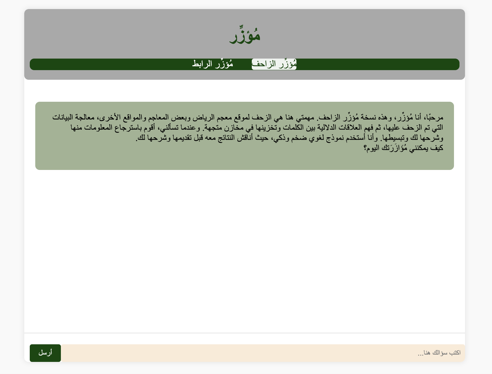
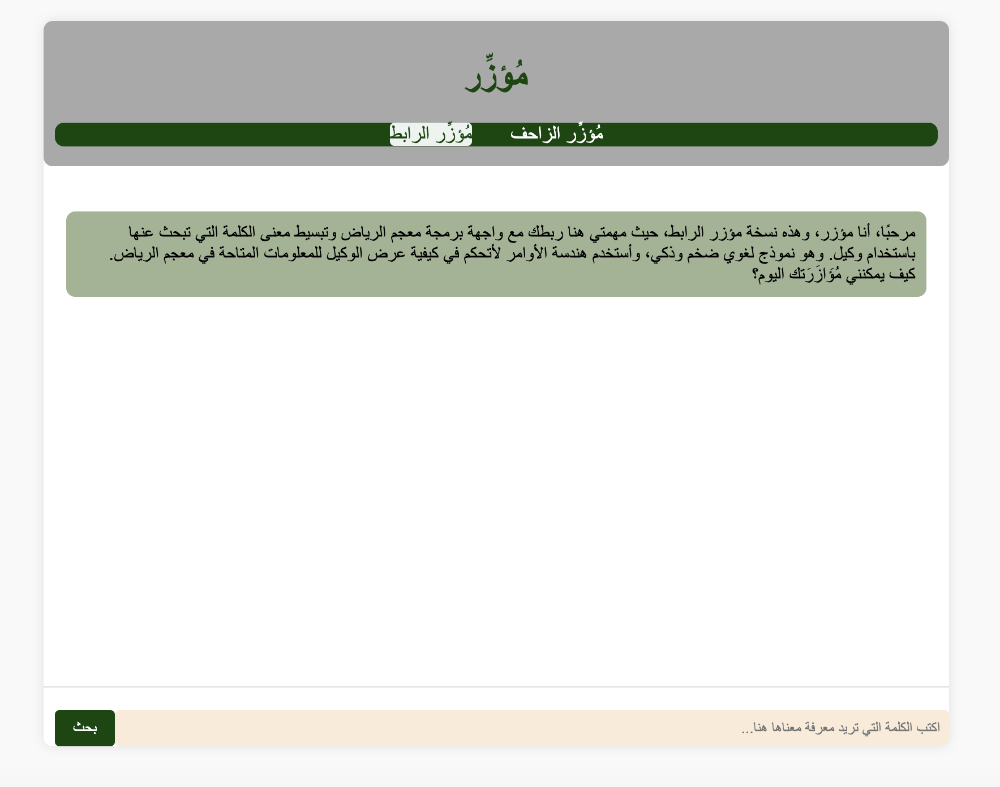

  
  
  

    <!-- Application description -->
    <h1>ماهو تطبيق مُؤزِّر؟</h1>
    

    هو تطبيق محادثة يستخدم النماذج اللغوية الضخمة لتقديم المساعدة لمستخدمي المعجم، حيث يمكن للمستخدمين طرح أسئلة حول معاني الكلمات، والقواعد النحوية، والتراكيب اللغوية. ويستخدم تطبيق محادثة نموذج لغوي ضخم غذي بالمعلومات المتوفرة في المعجم للإجابة على هذه الأسئلة بطريقة تفاعلية أكثر ذكاء وأكثر فهما لاحتياجات المستخدم. ويمكن القول يندرج تطبيق المحادثة سيكون ضمن فئة تطبيقات الذكاء الإصطناعي التوليدي.
    

    <!-- Expected benefits of the application -->
    <h2>الفوائد المتوقعة</h2>
    <ul>
      <li>سهولة الوصول إلى المعلومات اللغوية: يمكن للمستخدمين طرح الأسئلة بسهولة باستخدام واجهة مستخدم بسيطة.</li>
      <li>الدقة والموثوقية: يمكن أن يتم ضبط مخرجات النموذج اللغوي ضخم لتوفير معلومات دقيقة وموثوقة فقط.</li>
      <li>التفاعلية: يمكن للمستخدمين التفاعل مع النموذج اللغوي وطلب مزيد من المعلومات أو توضيحات.</li>
    </ul>
    <!-- Explanation of the application's name -->
    <h2>سبب التسمية</h2>
    

      وسبب تسمية التطبيق مُؤزِّر هو أن التطبيق يهدف إلى مساعدة مستخدمي معجم الرياض. فكلمة "مُؤزِّر" تعني "من يساعد ويدعم ويساند" وهو اسم فاعل من أَزَّرَ ونقول آزر فلانًا : عاونه وأيَّده، ساعده ووقف بجانبه. وبالتالي، فإن تسمية التطبيق بهذا الاسم تعكس هدفه الرئيسي وتعكس ثراء لغتنا العربية بالمعاني والمرادفات. بالإضافة إلى ذلك، فإن كلمة "مُؤزِّر" غير منتشرة في بين التطبيقات، وهذا يجعلها أكثر رسوخا في الذاكرة لتفرد التطبيق بهذا الاسم.
    

    <!-- Features of the application listed with explanations -->
    <h2>مميزات تطبيق مُؤزِّر</h2>
    <ul>
      <li>الزحف الفعّال:
        <ul>
            <li>قدرة التطبيق على الزحف بفعالية على مواقع معجم الرياض ومعاجم أخرى، مما يسمح بجمع البيانات بشكل شامل ومتكامل.</li>
        </ul>
    </li>
      <li>تحسين عميلة الوصول:
            <ul>
                <li>قدرة التطبيق على الزحف بفعالية على مواقع معجم الرياض ومعاجم أخرى، مما يسمح بجمع البيانات بشكل شامل ومتكامل.</li>
                <li>سهولة الوصول إلى المعلومات اللغوية في معجم الرياض، حيث يمكن للمستخدمين طرح الأسئلة بسهولة باستخدام واجهة مستخدم بسيطة، كأن المستخدم يطلب مساعدة شخص ما له.</li>
            </ul>
        </li>
        <li>معالجة بيانات متقدمة:
            <ul>
                <li>قدرة التطبيق على معالجة البيانات بشكل متقدم بمجرد جمعها، مما يسهم في استخراج العلاقات الدلالية بين الكلمات وتحليل المعلومات بشكل فعّال.</li>
            </ul>
        </li>
        <li>الاستفادة من قدرات النماذج اللغوية الضخمة:
            <ul>
                <li>تحسين الدقة والموثوقية باستخدام قدرات النماذج اللغوية الضخمة، حيث يمكن ضبط مخرجاتها لتوفير معلومات دقيقة وموثوقة فقط.</li>
            </ul>
        </li>
        <li>تفاعلية الاستفسار:
            <ul>
                <li>التفاعل مع النموذج اللغوي وطلب مزيد من المعلومات أو توضيحات، وربما بعض الصور التوضيحية أيضًا، فذلك يعتمد على النموذج الذي يتم ربطه به.</li>
            </ul>
        </li>      
        <li>معالجة بيانات متقدمة:
            <ul>
                <li>قدرة التطبيق على معالجة البيانات بشكل متقدم بمجرد جمعها، مما يسهم في استخراج العلاقات الدلالية بين الكلمات وتحليل المعلومات بشكل فعّال.</li>
            </ul>
        </li>
        <li>تخزين فعّال في مخازن متجهة:
            <ul>
                <li>إمكانية تخزين البيانات بشكل فعّال في مخازن متجهة، مما يسهل الوصول السريع والفعّال للمعلومات عند الاستعلام.</li>
            </ul>
        </li>
        <li>تواصل تفاعلي:
            <ul>
                <li>توفير واجهة تفاعلية للمستخدم، مما يمكنهم من تقديم الاستفسارات والتفاعل مع النموذج اللغوي بسهولة وفعالية.</li>
            </ul>
        </li>
        <li>استخدام نموذج لغوي ضخم:
            <ul>
                <li>استفادة التطبيق من نموذج لغوي ضخم وذكي، الذي يسمح بفهم وتحليل البيانات بشكل متقدم، مما يعزز دقة وموثوقية النتائج.</li>
            </ul>
        </li>
        <li>تفسير وتبسيط المعلومات:
            <ul>
                <li>القدرة على تفسير وتبسيط المعلومات عند الاستعلام، مما يجعلها أكثر فهمًا للمستخدمين ويسهل استيعابها.</li>
            </ul>
        </li>
        <li>التحكم في عرض الوكيل:
            <ul>
                <li>إمكانية التحكم في كيفية عرض الوكيل للمعلومات المتاحة في معجم الرياض، مما يتيح تخصيص العرض وفقًا لاحتياجات المستخدم.</li>
            </ul>
        </li>
        <li>تحقيق التفاعل الديناميكي:
            <ul>
                <li>التفاعل الديناميكي مع المستخدمين، حيث يمكنهم طلب مزيد من المعلومات أو التوضيحات، مما يجعل تجربة البحث أكثر تفاعلًا وشمولية.</li>
            </ul>
        </li>
    </ul>
    <!-- Technologies used in the application -->
    <h2>التقنيات المستخدمة</h2>
    <ul>
      <li>استخدام إطار العمل LangChain المخصص لبناء تطبيقات تتفاعل مع النماذج اللغوية الضخمة، وهو مكتبة مفتوحة المصدر.</li>
     <li>
        ChromaDB، قاعدة بيانات متجهة مفتوحة المصدر.
      </li>
      <li>استخدام واجهة برمجة التطبيقات (API) الخاصة بـ OpenAI كنموذج لغوي ضخم، ويمكن استبداله لاحقًا بنموذج لغوي ضخم مفتوح المصدر ينشر في السحابة.</li>
      <li>استخدام إطار العمل Flask بلغة بايثون لبناء التطبيق.</li>
      <li>في عملية الزحف للحصول على البيانات، تم الزحف على بعض الصفحات من معجم الرياض وبعض الصفحات من موقع قاموس ومعجم المعاني. تم فهرستها وتضمينها لاستخراج المعاني الدلالية، ثم تم تخزين هذه المعاني الدلالية  في مخازن متجهة وتمكين النموذج اللغوي الضخم من استرجاعها وعرضها للمستخدم.</li>
      <li>استخدام الربط مع واجهة برمجة التطبيقات (API) من معجم الرياض. تم برمجة وظيفة الربط لكي تعمل كوكيل. ويستخدم النموذج اللغوي الضخم مع هندسة الأوامر للتحكم في كيفية عرض الوكيل للمعلومات المتاحة في معجم الرياض.</li>
      <li>الخطوات التي تم استخدامها نستطيع أن نصفها نموذج تجريبي، يهدف لتوضيح وإظهار كيف ستكون العملية الأساسية عند التطوير الفعلي.</li>
   </ul>

  <h2>فريق العمل</h2>
  <ul>
    <li> رقيا بن صافي </li>
      <ul>
        <li>
         مهندسة ذكاء اصطناعي تعمل على تطوير منتجات وحلول ذكاء اصطناعي مبتكرة. وهي معترف بها كخبيرة مطوري Google في التعلم الآلي، وبطلة Google Cloud Innovator، ومرشدة متخصصة في تعلم الآلة في Google Accelerator for Startups الشرق الأوسط وشمال إفريقيا، وسفيرة WTM.
        تمتد خبرة رقيا عبر جميع مراحل مشاريع الذكاء الاصطناعي المستندة إلى السحابة، بما في ذلك جمع البيانات وإنشاء خطوط الأنابيب ومعالجة البيانات وتحليلها والتدريب النموذجي والنشر. وفي أحدث دور لها في شركة جديدة، حولت تركيزها نحو تطوير المنتجات المتطورة التي تستغل قوة التقنيات الناشئة. تشمل هذه التقنيات الذكاء الإصطناعي التوليدي ونماذج اللغات الكبيرة (LLMs)، ومعالجة اللغات الطبيعية (NLP)، وأطر العمل مختلفة لإنشاء تطبيقات الذكاء الاصطناعي التوليدي.
        </li>
      </ul>
  </ul>
  
